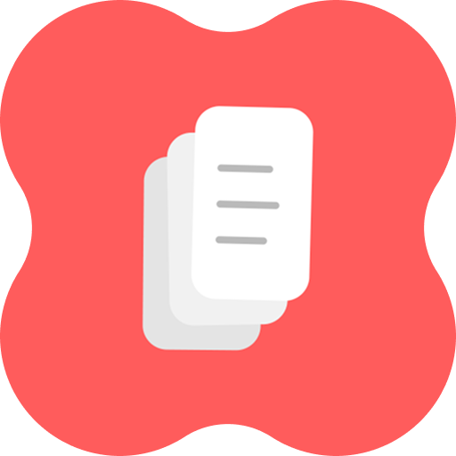

<p align="center">
  
</p>

<h1 align="center">Sometime</h1>

<p align="center">
  <a href="https://github.com/Pizzateik/Sometime/releases"></a>
  <a href="https://github.com/Pizzateik/Sometime/releases"></a>
  
  
  <a href="LICENSE"></a>
</p>

<p align="center">
  <br>
  
  
  
  
  
  
</p>

<p align="center">
  <strong>Today. Soon. Sometime.</strong><br>
  A calm todo app organized around when something matters, not where it belongs.
</p>

<p align="center">
  Organization should reduce organization, not create more.
</p>

Most todo apps place something that matters today beside something you may want to do next month. Sometime separates these intentions into three broad horizons. You can use it without projects, folders, tags, accounts, or another planning system.

## Three horizons

### Today

Keep the tasks that matter now in view.

### Soon

Set aside tasks that need attention in the near future.

### Sometime

Remember an idea without putting it on today's list.

## Just write it down

Create a task and add details only when you need them. Sometime recognizes natural dates and times. It also supports local reminders and recurring tasks.

## Keep important tasks close

Pin a task as an Android notification when it must stay visible. Add a Sometime widget to a home screen for quick access to current tasks.

## Make it yours

Use Spaces for separate parts of life or work. Choose light, dark, or soft appearance options. On supported Android devices, use Material You colors or select a custom color.

## Private by default

- No account is required.
- Sometime has no analytics.
- Sometime has no advertising.
- Sometime sends no task telemetry.
- Sometime has no cloud backend of its own.
- Your tasks remain on your device.

## Download

<p align="center">
  <a href="https://github.com/Pizzateik/Sometime/releases"><strong>View Android release candidates</strong></a>
</p>

The APK is distributed through [GitHub Releases](https://github.com/Pizzateik/Sometime/releases). GitHub marks release candidates as prereleases.

## Requirements

- Android 7.0 (API 24) or later.

## Architecture

Sometime uses Flutter for its shared interface and application logic. It stores task data on the device. Native code connects the app to system reminders, notifications, and home screen widgets.

- Flutter and Dart for the app interface and application logic.
- Local-first persistence for tasks and settings.
- Kotlin for Android system integrations.
- Swift for iOS integrations where required.

## Development

Use Flutter 3.47.2 with a compatible Dart 3.13 SDK.

```bash
git clone https://github.com/Pizzateik/Sometime.git
cd Sometime
flutter pub get
flutter run
```

Run the project checks before you open a pull request.

```bash
flutter analyze
flutter test
```

Build the F-Droid APK without Play Billing or production signing credentials.

```bash
flutter build apk --release --flavor fdroid
```

This flavor keeps the app offline and excludes Play Billing from the APK.

Production signing credentials are not included. Debug builds do not need them.

## Status

Sometime is preparing its first 1.0 release candidate for Android. No store listing is available yet.

## Contributing

Issues and focused pull requests will be welcome after the repository becomes public.

## License

Sometime source code is licensed under the [Apache License 2.0](LICENSE). Copyright 2026 Eik.

The Sometime name, app icon, logo, and original artwork have [separate brand terms](assets/BRAND_ASSETS_LICENSE.md). Bundled third-party resources remain under their [existing licenses](THIRD_PARTY_NOTICES.md).
