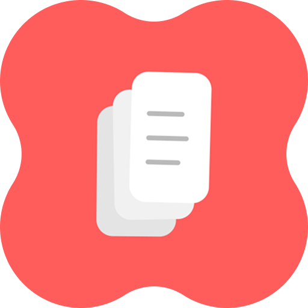

<p align="center">
  
</p>

<h1 align="center">Sometime</h1>

<p align="center">
  <strong>Today. Soon. Sometime.</strong><br>
  Not everything belongs on today's list.
</p>

<p align="center">
  <a href="https://github.com/Pizzateik/Sometime/releases"></a>
  <a href="https://github.com/Pizzateik/Sometime/releases"></a>
  
  
  <a href="LICENSE"></a>
</p>

<p align="center">
  &nbsp;&nbsp;
  &nbsp;&nbsp;
  
</p>
<p align="center">
  &nbsp;&nbsp;
  &nbsp;&nbsp;
  
</p>

## Why Sometime exists

Most task apps mix today's work with ideas that can wait. Sometime separates tasks by when they matter.

Use **Today**, **Soon**, and **Sometime** without projects, tags, or a complex planning system.

## What Sometime does

- Write a task and use natural dates and times when you need them.
- Ask Siri or Google Assistant to add a task, with a category, date, or time. Tasks without a category go to Soon.
- Add local reminders and recurring schedules.
- Pin important tasks as Android notifications.
- See current tasks in Android home screen widgets.
- Use Spaces to separate parts of your life or work.
- Choose light, dark, soft, Material You, or custom colors.

## Voice task entry

On iOS 16 or later, ask Siri to “add a task in Sometime” or use the **Add Task** action in Shortcuts. The action accepts a category, date, and time. On Android, Google Assistant App Actions can add a task to Sometime; English (US) phrases can include a category, date, and time. If no category is given, the task goes to **Soon**. Voice-created tasks use the first Space and do not enable a reminder unless you add one later.

Google Assistant App Actions require a Google Play release and review. Gemini uses a separate AppFunctions integration, so Gemini task creation is not guaranteed by these App Actions.

## Private, offline-first, and open source

Sometime stores your tasks on your device. It needs no account and has no advertising, analytics, task telemetry, or cloud backend.

The source code and original artwork are public under the Apache License 2.0. Trademark rights in the Sometime name and logo are separate.

Developer website: [eikrose.de](https://eikrose.de).

## Download

Download Sometime for Android from [GitHub Releases](https://github.com/Pizzateik/Sometime/releases).

Sometime requires Android 7.0 (API 24) or later.

## Development and F-Droid build

Use Flutter 3.47.2 with a compatible Dart 3.13 SDK.

```bash
git clone https://github.com/Pizzateik/Sometime.git
cd Sometime
flutter pub get
flutter run
```

Run the project checks:

```bash
flutter analyze
flutter test
```

Build the F-Droid flavor without Play Billing or production signing credentials:

```bash
flutter build apk --release --flavor fdroid
```

This command creates an unsigned APK for F-Droid to sign. For a locally installable APK, build the debug variant instead. Sometime is not available through F-Droid yet. See [F-Droid release notes](docs/fdroid.md) for the submission steps.

## Contributing

Bug reports, feature requests, and focused pull requests are welcome. Read [CONTRIBUTING.md](CONTRIBUTING.md) before you start.

Report security issues privately as described in [SECURITY.md](SECURITY.md).

## License

Sometime source code uses the [Apache License 2.0](LICENSE). Copyright 2026 Eik.

Original Sometime artwork is also Apache-2.0-licensed; [trademark details](assets/BRAND_ASSETS_LICENSE.md) and [third-party licenses](THIRD_PARTY_NOTICES.md) are documented separately.

<p align="center">Made with ❤️ by Eik</p>
